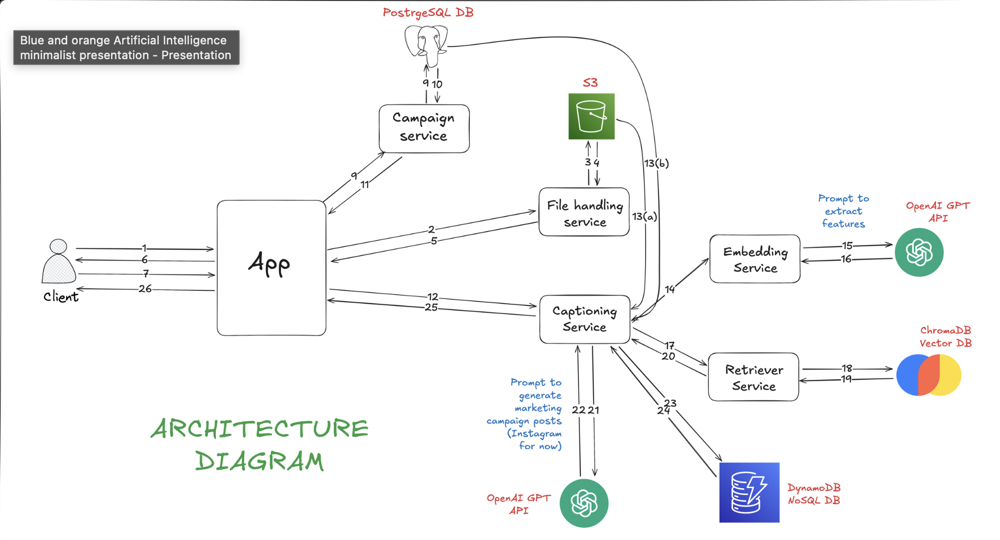
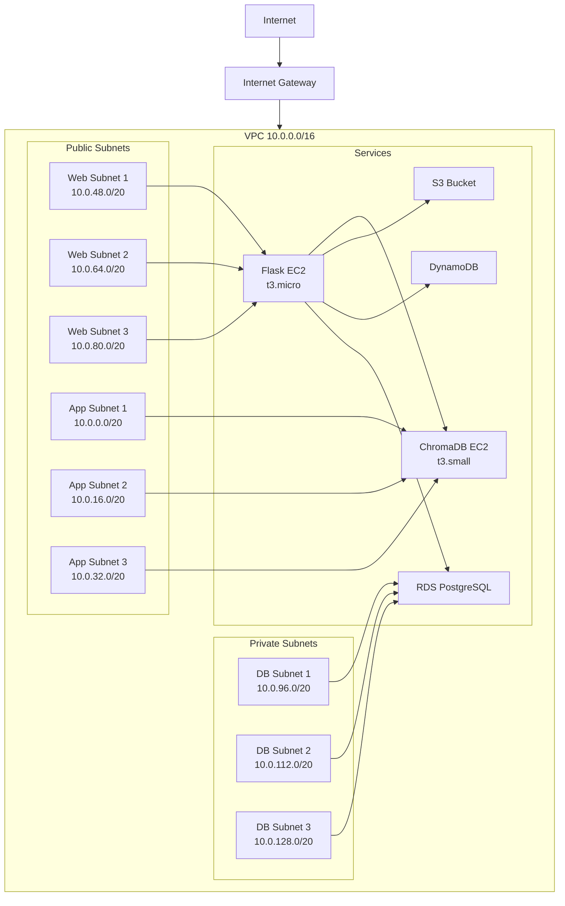
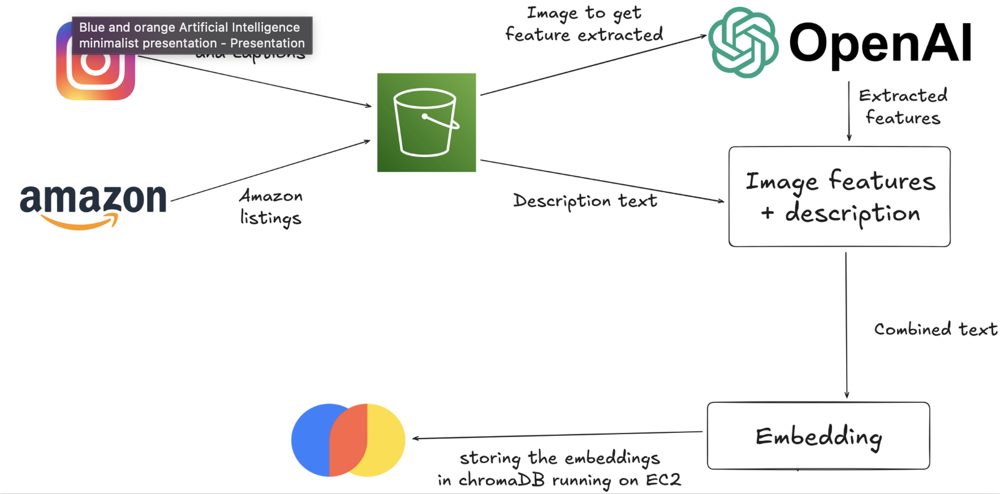

# GenAI Marketing Platform

A comprehensive marketing platform powered by Generative AI, designed to streamline marketing operations and enhance content creation.

## 🚀 Features

- **AI-Powered Content Generation**: Create high-quality marketing content using advanced language models
- **Multi-Channel Support**: Generate content optimized for various marketing channels
- **Data-Driven Insights**: Leverage analytics to improve marketing strategies
- **Collaborative Workspace**: Team-based content creation and management
- **Customizable Templates**: Pre-built templates for different marketing needs

## 🏗️ Project Structure

```
.
├── backend/           # FastAPI-based backend service
│   ├── app/          # Application core
│   ├── database/     # Database models and migrations
│   ├── services/     # Business logic and services
│   └── tests/        # Backend test suite
├── frontend/         # Web-based frontend application
│   ├── images/       # Static images and assets
│   ├── script.js     # Frontend JavaScript
│   ├── style.css     # Frontend styles
│   └── index.html    # Main application page
├── datascripts/      # Data processing and ETL scripts
├── infrastructure/   # Infrastructure as Code (IaC)
└── docker-compose.yml # Docker Compose configuration
```

## 🏢 System Architecture



The above diagram illustrates the high-level architecture of the GenAI Marketing Platform, showing the interaction between different components and services.

## ☁️ Cloud Infrastructure

The platform is deployed on AWS using CloudFormation for infrastructure as code. The infrastructure includes:

- **VPC with Public and Private Subnets**: Segregated network architecture for security
- **EC2 Instances**: 
  - Flask Main Service (t3.micro)
  - ChromaDB Service (t3.small)
- **Database Layer**:
  - RDS PostgreSQL for structured data
  - DynamoDB for unstructured campaign data
- **Storage**:
  - S3 Bucket for media storage
- **Security**:
  - Security Groups for EC2 and RDS
  - Private subnets for database layer



### Infrastructure Components

1. **Networking**:
   - VPC with CIDR block 10.0.0.0/16
   - Public subnets for web and application layers
   - Private subnets for database layer
   - Internet Gateway for public access
   - Route tables for network traffic management

2. **Compute**:
   - Flask EC2 Instance (t3.micro) for main application
   - ChromaDB EC2 Instance (t3.small) for vector database
   - Security groups for controlled access

3. **Storage**:
   - RDS PostgreSQL (db.t3.micro) for structured data
   - DynamoDB for campaign drafts and unstructured data
   - S3 bucket for media storage with public access

4. **Security**:
   - Security groups for EC2 and RDS
   - Private subnets for sensitive data
   - Controlled public access to S3 bucket

## 📊 Data Engineering Pipeline



This diagram showcases our data engineering pipeline, detailing how we processed 12000 products from Amazon listings and 5000 Instagram posts for our RAG.

## 🛠️ Technology Stack

### Backend
- **Framework**: FastAPI
- **Database**: PostgreSQL
- **AI/ML**: LangChain, OpenAI, ChromaDB
- **Authentication**: JWT
- **API Documentation**: OpenAPI/Swagger

### Frontend
- **Core**: HTML5, CSS3, JavaScript
- **Styling**: Custom CSS
- **Build Tools**: Docker

## 🚀 Getting Started

### Prerequisites
- Docker and Docker Compose
- Python 3.8+
- Node.js (for frontend development)

### Installation

1. Clone the repository:
```bash
git clone https://github.com/yourusername/genai-marketing-platform.git
cd genai-marketing-platform
```

2. Set up environment variables:
```bash
cp .env.example .env
# Edit .env with your configuration
```

3. Start the application using Docker Compose:
```bash
docker-compose up -d
```

The application will be available at:
- Frontend: http://localhost:3000
- Backend API: http://localhost:8000
- API Documentation: http://localhost:8000/docs

## 📚 Documentation

- [API Documentation](http://localhost:8000/docs)
- [Contributing Guidelines](CONTRIBUTING.md)
- [Code of Conduct](CODE_OF_CONDUCT.md)

## 🤝 Contributing

We welcome contributions! Please read our [Contributing Guidelines](CONTRIBUTING.md) for details on our code of conduct and the process for submitting pull requests.

## 📝 License

This project is licensed under the MIT License - see the [LICENSE](LICENSE) file for details.

## 🙏 Acknowledgments

- OpenAI for their language models
- FastAPI team for the excellent web framework
- All contributors who have helped shape this project
